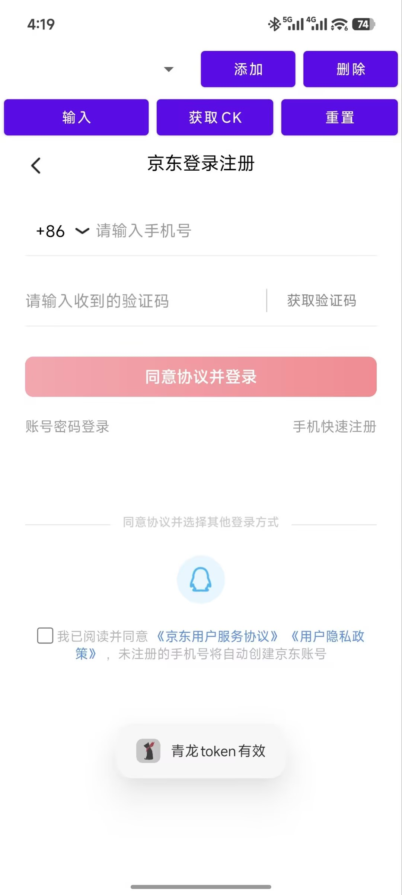

# 青龙面板 京东cookie 助手 安卓版

## 说明

需要修改使用JDK11，太新版本跑不起来
更换了国内源，更新更快
内置青龙后台方便使用

## 优化
* 修改青龙面板的对应的接口地址
* 使用ClientID和ClientSecret进行接口对接
* 自动启用发送过去的脚本

## 功能
* 保存/删除手机号
* 一键输入手机号并打勾协议
* 一键复制cookie
* 清空cookie并重新加载
* 支持青龙面板登录及更新cookie
* 支持短信验证码自动识别

### 账号密码输入说明
* 需要先手动切换到账号密码登录页
* 账号密码使用空格分开 示例 18888888888 123456
* 有密码的会自动点击登录按钮

## 界面展示

